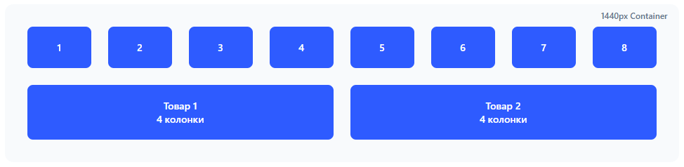

# Адаптивные макеты - ТехноМарт

**Проект:** ТехноМарт - Интернет-магазин электроники

---

## 1. Введение

Согласно заданию, необходимо разработать адаптивные макеты для различных разрешений экрана с использованием модульной сетки (Grid System).

### Целевые разрешения для веб-приложения

| Название | Разрешение (px) | Устройства | Колонок в сетке |
|----------|-----------------|------------|-----------------|
| Desktop XL | 1440+ | Большие мониторы | 12 |
| Desktop L | 992-1199 | Стандартные мониторы | 12 |
| Tablet Landscape | 768-991 | Планшеты горизонтально | 8 |
| Tablet Portrait | 576-767 | Планшеты вертикально | 4 |
| Mobile L | 400-575 | Большие смартфоны | 4 |
| Mobile M | 320-399 | Средние смартфоны | 4 |

---

## 2. Система сеток (Grid System)

### 2.1. Принципы модульной сетки

**Основные параметры:**
- **Ширина контейнера:** переменная в зависимости от разрешения
- **Количество колонок:** 12 (десктоп), 8 (планшет landscape), 4 (планшет portrait/мобильный)
- **Отступ между колонками (gutter):** 24px (десктоп), 16px (планшет), 12px (мобильный)
- **Боковые отступы (padding):** 32px (десктоп), 24px (планшет), 16px (мобильный)

### 2.2. Расчет сетки для Desktop XL (1440px)

**Параметры:**
- Ширина контейнера: 1440px
- Колонок: 12
- Gutter: 24px (всего 11 отступов)
- Padding: 32px × 2 = 64px

**Расчет ширины колонки:**
```
Доступная ширина = 1440px - 64px (padding) - (11 × 24px) = 1112px
Ширина колонки = 1112px / 12 = 92.67px ≈ 93px
```

**Итоговая сетка 1440px:**
- 12 колонок по 93px
- 11 gutters по 24px
- Padding: 32px слева и справа

### 2.3. Сетки для других разрешений

#### Desktop L (992-1199px) - контейнер 1140px
- 12 колонок по 84px
- 11 gutters по 24px
- Padding: 24px

#### Tablet Landscape (768-991px) - контейнер 960px
- 8 колонок по 96px
- 7 gutters по 24px
- Padding: 24px

#### Tablet Portrait (576-767px) - контейнер 720px
- 4 колонки по 162px
- 3 gutters по 16px
- Padding: 24px

#### Mobile L (400-575px) - контейнер 100%
- 4 колонки (flex)
- Gutters: 12px
- Padding: 16px

#### Mobile M (320-399px) - контейнер 100%
- 4 колонки (flex)
- Gutters: 12px
- Padding: 16px

---

## 3. Главная страница - Адаптация для всех разрешений

### 3.1. Desktop XL (1440px)

**Структура:**


**Характеристики:**
- Колонок товаров в ряду: 4
- Видимые товары: 8 (два ряда)
- Категорий в ряду: 4
- Высота hero: 400px

---

### 3.2. Desktop L (992-1199px)

**Изменения относительно Desktop XL:**


**Характеристики:**
- Колонок товаров: 4
- Высота hero: 360px
- Уменьшенные изображения
- Меньшие отступы

---

### 3.3. Tablet Landscape (768-991px)

**Значительные изменения:**



### 3.4. Tablet Portrait (576-767px)

**Мобильная адаптация:**


**Характеристики:**
- Товары: 1 в ряду (но с горизонтальной карточкой)
- Категории: 2 в ряду
- Высота hero: 280px
- Компактная шапка

---

### 3.5. Mobile L (400-575px)

**Полная мобильная версия:**


**Характеристики:**
- Товары: 1 в столбец
- Категории: горизонтальный скролл
- Высота hero: 240px
- Footer с аккордеоном
- Sticky header

---

### 3.6. Mobile M (320-399px)


**Характеристики:**
- Максимально упрощен
- Компактные элементы
- Минимум текста
- Высота hero: 200px


## 4. Компоненты с адаптивным поведением

### 4.1. Навигация

**Desktop:** Горизонтальное меню  
**Tablet:** Сокращенное меню  
**Mobile:** Burger menu

### 4.2. Карточки товаров

**Desktop XL/L:** 4 в ряду  
**Tablet Landscape:** 3 в ряду  
**Tablet Portrait:** 2 в ряду  
**Mobile:** 1 в ряду (вертикальная)

### 4.3. Фильтры

**Desktop:** Боковая панель (sticky)  
**Tablet/Mobile:** Modal/Drawer снизу

### 4.4. Footer

**Desktop:** 4 колонки  
**Tablet:** 2 колонки  
**Mobile:** Аккордеон или стек

---
## 5. Интерактивный прототип
