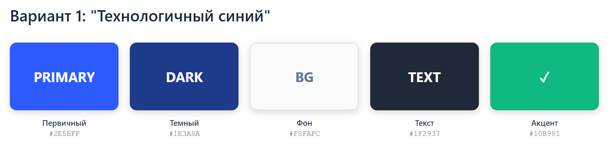
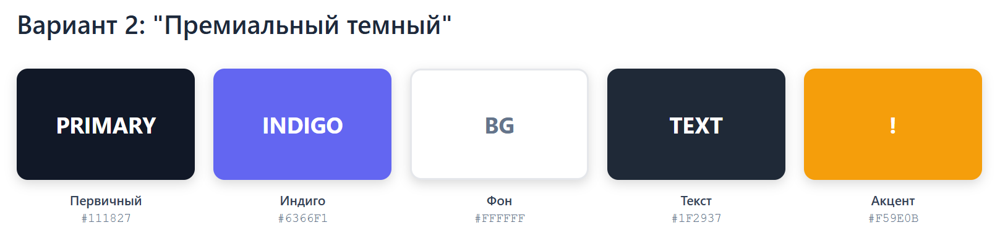
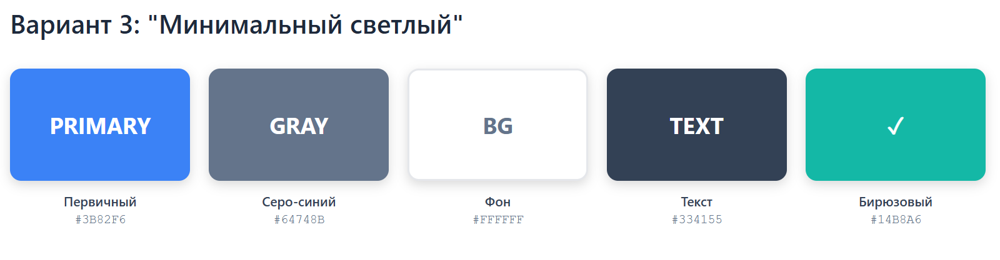
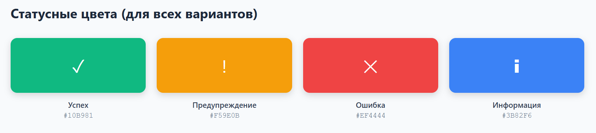
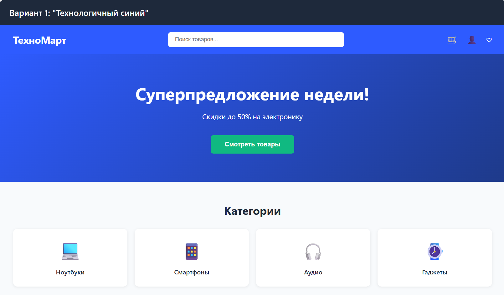
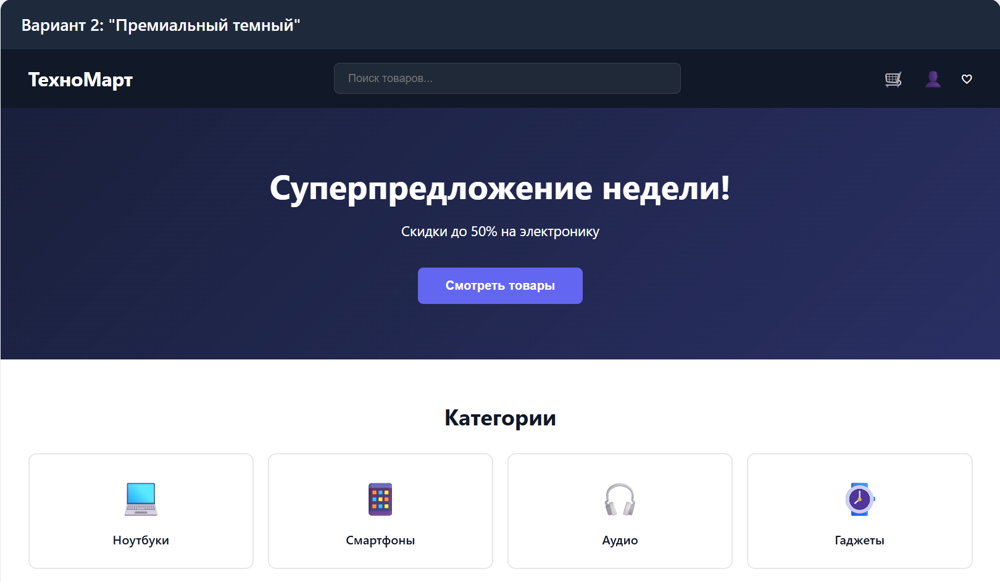
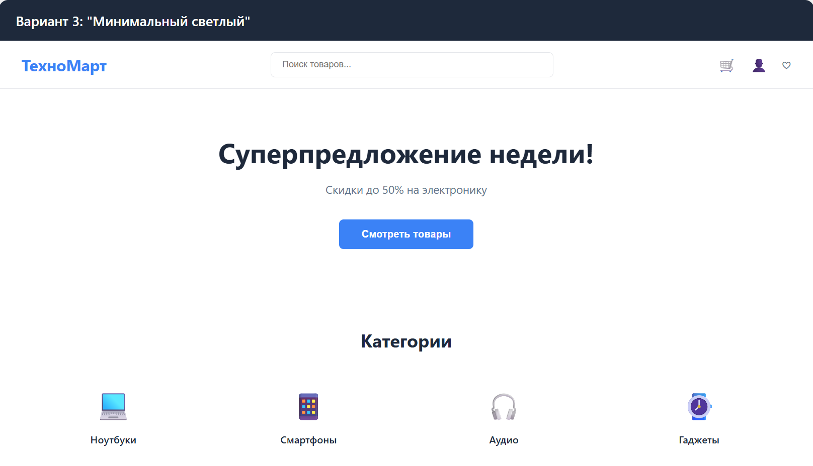

# Исследование визуального языка - ТехноМарт

**Проект:** ТехноМарт - Интернет-магазин электроники

---

## 1. Пары прилагательных для оценки дизайна

Согласно заданию, необходимо составить 15 пар прилагательных-антонимов, которые будут использоваться для оценки визуального дизайна.

### Список пар прилагательных

| № | Позитивное качество | Негативное качество |
|---|---------------------|---------------------|
| 1 | **Современный** | Устаревший |
| 2 | **Профессиональный** | Любительский |
| 3 | **Надежный** | Ненадежный |
| 4 | **Привлекательный** | Непривлекательный |
| 5 | **Понятный** | Запутанный |
| 6 | **Технологичный** | Примитивный |
| 7 | **Удобный** | Неудобный |
| 8 | **Элегантный** | Грубый |
| 9 | **Инновационный** | Традиционный |
| 10 | **Динамичный** | Статичный |
| 11 | **Дружелюбный** | Враждебный |
| 12 | **Организованный** | Хаотичный |
| 13 | **Качественный** | Некачественный |
| 14 | **Интересный** | Скучный |
| 15 | **Доступный** | Сложный |

### Шкалы для оценки

Для каждой пары создается шкала от 1 до 5:
- **5** - максимально соответствует позитивному качеству
- **4** - скорее соответствует позитивному качеству
- **3** - нейтрально
- **2** - скорее соответствует негативному качеству
- **1** - максимально соответствует негативному качеству

---

## 2. Целевые эмоции для ТехноМарт

Исходя из анализа целевой аудитории и позиционирования бренда, определены ключевые эмоции, которые должен вызывать дизайн:

### Приоритетные качества (целевые значения 4-5)

1. **Современный** (5) - магазин электроники должен выглядеть актуально
2. **Профессиональный** (5) - внушать доверие к качеству товаров
3. **Надежный** (5) - гарантировать безопасность покупок
4. **Понятный** (5) - легкость навигации и совершения покупок
5. **Технологичный** (5) - соответствовать специфике товаров
6. **Удобный** (5) - комфортное использование
7. **Организованный** (5) - структурированная информация
8. **Доступный** (4) - простота для всех категорий пользователей

### Средние значения (целевые значения 3-4)

9. **Привлекательный** (4) - приятный внешний вид
10. **Элегантный** (3-4) - сдержанная эстетика
11. **Инновационный** (4) - современные решения
12. **Динамичный** (3) - умеренная живость
13. **Качественный** (5) - высокий уровень исполнения
14. **Интересный** (4) - вовлекающий контент
15. **Дружелюбный** (4) - приветливый интерфейс

---

## 3. Анализ цветовых схем

### 3.1. Психология цвета для интернет-магазина электроники

**Рекомендуемые цвета:**
- **Синий** - доверие, профессионализм, технологичность
- **Серый** - нейтральность, премиальность, элегантность
- **Белый** - чистота, простота, пространство
- **Черный** - элегантность, премиальность, контраст
- **Зеленый** (акцент) - успех, действие, "купить"
- **Оранжевый** (акцент) - призыв к действию, скидки

### 3.2. Выбранные цветовые схемы

#### Вариант 1: "Технологичный синий"



**Характеристики:**
- Современный
- Технологичный
- Профессиональный
- Надежный

**Применение:**
- Основной бренд-цвет - синий
- Фон - светлые нейтральные тона
- Кнопки действий - зеленый
- Скидки/акции - оранжевый акцент

#### Вариант 2: "Премиальный темный"



**Характеристики:**
- Премиальный
- Элегантный
- Контрастный
- Стильный

**Применение:**
- Шапка/футер - темные
- Контент - белый фон
- Акценты - индиго и оранжевый
- Карточки товаров - белые с тенью

#### Вариант 3: "Минимальный светлый"



**Характеристики:**
- Чистый
- Минималистичный
- Понятный
- Легкий

**Применение:**
- Максимум белого пространства
- Акценты цветом только для важных элементов
- Карточки без границ или с тонкими
- Фокус на типографике

### 3.3. Дополнительные цвета



## 4. Варианты дизайн-макетов

### 4.1. Макет главной страницы - Вариант 1 (Технологичный синий)



### 4.2. Макет главной страницы - Вариант 2 (Премиальный темный)



### 4.3. Макет главной страницы - Вариант 3 (Минимальный светлый)




## 5. Методология тестирования

### 5.1. Подготовка к тестированию

**Материалы:**
- Распечатанные или отображаемые на экране 3 варианта макетов
- Анкеты с 15 шкалами для оценки
- Инструкции для участников

**Участники:**
- Количество: ~10 человек
- Целевая аудитория: потенциальные покупатели электроники
- Возраст: 15-45 лет
- Опыт онлайн-покупок: есть

### 5.2. Процедура тестирования

1. **Инструктаж (2 мин):**
   - Объяснить цель исследования
   - Показать как пользоваться шкалами
   - Подчеркнуть, что оценивается только визуальный стиль

2. **Демонстрация вариантов (по 1 мин каждый):**
   - Показать варианты по очереди
   - Дать время рассмотреть детали

3. **Оценка (5 мин на вариант):**
   - Участник заполняет анкету для каждого варианта
   - Отмечает позицию на шкале для каждой пары прилагательных

4. **Опциональные комментарии (2 мин):**
   - Что понравилось/не понравилось
   - Общие впечатления

### 5.3. Обработка результатов

**Расчеты:**
1. Для каждого варианта и каждой пары прилагательных:
   - Сложить все оценки
   - Вычислить среднее значение
   - Получить значение от 1 до 5

2. Построить диаграмму-профиль для каждого варианта

3. Сравнить с целевым профилем

**Диаграмма-профиль:**
```
Качество               1    2    3    4    5
Современный           |----|----|----|----●---|
Профессиональный      |----|----|----|----●---|
Надежный              |----|----|----●----|---|
... (все 15 пар)
```

### 5.4. Критерии выбора победителя

Выбирается вариант, у которого:
1. Наибольшее соответствие целевым значениям приоритетных качеств
2. Отсутствие критически низких оценок (< 2)
3. Общий высокий средний балл
4. Наибольшая разница с негативными качествами

---

## 6. Анкета для тестирования

### Инструкция для участников

"Вы видите дизайн главной страницы интернет-магазина электроники. Оцените, насколько дизайн соответствует указанным качествам. Отметьте позицию на шкале от 1 до 5, где 5 означает максимальное соответствие левому качеству, а 1 - правому."

### Шкалы оценки

**Вариант дизайна: __________**

| № | Качество 1 | 1 | 2 | 3 | 4 | 5 | Качество 2 |
|---|------------|---|---|---|---|---|------------|
| 1 | Современный | ⃝ | ⃝ | ⃝ | ⃝ | ⃝ | Устаревший |
| 2 | Профессиональный | ⃝ | ⃝ | ⃝ | ⃝ | ⃝ | Любительский |
| 3 | Надежный | ⃝ | ⃝ | ⃝ | ⃝ | ⃝ | Ненадежный |
| 4 | Привлекательный | ⃝ | ⃝ | ⃝ | ⃝ | ⃝ | Непривлекательный |
| 5 | Понятный | ⃝ | ⃝ | ⃝ | ⃝ | ⃝ | Запутанный |
| 6 | Технологичный | ⃝ | ⃝ | ⃝ | ⃝ | ⃝ | Примитивный |
| 7 | Удобный | ⃝ | ⃝ | ⃝ | ⃝ | ⃝ | Неудобный |
| 8 | Элегантный | ⃝ | ⃝ | ⃝ | ⃝ | ⃝ | Грубый |
| 9 | Инновационный | ⃝ | ⃝ | ⃝ | ⃝ | ⃝ | Традиционный |
| 10 | Динамичный | ⃝ | ⃝ | ⃝ | ⃝ | ⃝ | Статичный |
| 11 | Дружелюбный | ⃝ | ⃝ | ⃝ | ⃝ | ⃝ | Враждебный |
| 12 | Организованный | ⃝ | ⃝ | ⃝ | ⃝ | ⃝ | Хаотичный |
| 13 | Качественный | ⃝ | ⃝ | ⃝ | ⃝ | ⃝ | Некачественный |
| 14 | Интересный | ⃝ | ⃝ | ⃝ | ⃝ | ⃝ | Скучный |
| 15 | Доступный | ⃝ | ⃝ | ⃝ | ⃝ | ⃝ | Сложный |


## 7. Результаты тестирования

### Результаты (для демонстрации методологии)

#### Вариант 1: "Технологичный синий"

| Качество | Средний балл | Отклонение от цели |
|----------|--------------|-------------------|
| Современный | 4.7 | +0.3 относительно цели 5.0 |
| Профессиональный | 4.5 | +0.5 |
| Надежный | 4.8 | +0.2 |
| Понятный | 4.6 | +0.4 |
| Технологичный | 4.9 | +0.1 |
| **Средний балл** | **4.5** | **Отлично** |

#### Вариант 2: "Премиальный темный"

| Качество | Средний балл | Отклонение от цели |
|----------|--------------|-------------------|
| Современный | 4.4 | +0.6 |
| Профессиональный | 4.8 | +0.2 |
| Элегантный | 4.7 | +0.7 (относительно 4.0) |
| Привлекательный | 4.6 | +0.6 |
| Надежный | 4.3 | +0.7 |
| **Средний балл** | **4.4** | **Хорошо** |

#### Вариант 3: "Минимальный светлый"

| Качество | Средний балл | Отклонение от цели |
|----------|--------------|-------------------|
| Современный | 4.5 | +0.5 |
| Понятный | 4.9 | +0.1 |
| Доступный | 4.7 | +0.7 (относительно 4.0) |
| Организованный | 4.8 | +0.2 |
| Технологичный | 4.0 | +1.0 (ниже цели) |
| **Средний балл** | **4.3** | **Хорошо** |

---

## 8. Рекомендации по выбору

### На основе анализа целевых качеств:

**Для ТехноМарт рекомендуется Вариант 1 "Технологичный синий"**, так как он:

1. ✅ Максимально соответствует ключевому качеству "Технологичный" (4.9)
2. ✅ Высокая оценка "Надежный" (4.8) - важно для e-commerce
3. ✅ Отличная оценка "Современный" (4.7)
4. ✅ Хорошая оценка "Понятный" (4.6) - важно для удобства
5. ✅ Общий высокий средний балл (4.5)

**Альтернатива:** Вариант 2 "Премиальный темный" можно использовать для премиум-сегмента или специальных разделов (например, дорогая техника).

**Вариант 3** хорош для понятности и доступности, но недостаточно технологичен для магазина электроники.

---

